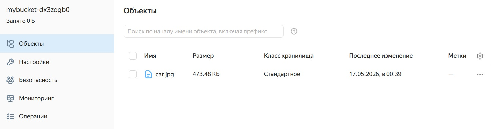
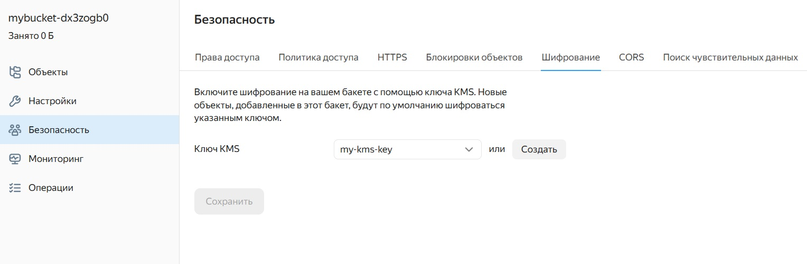
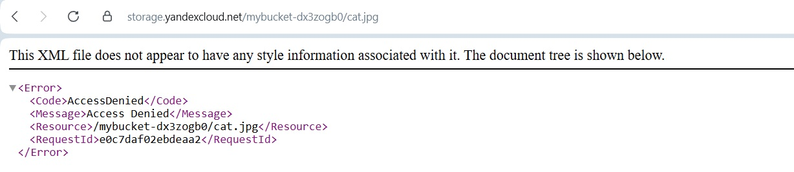
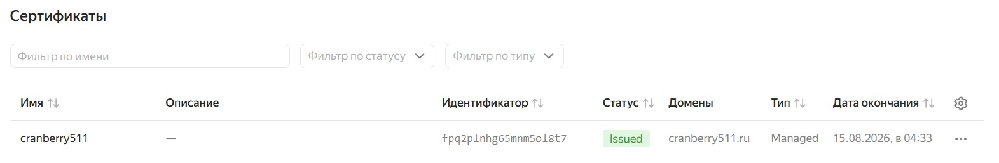
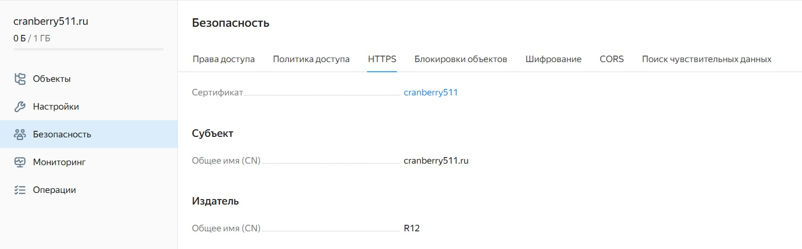
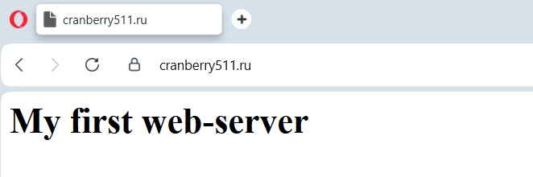

## Решение задания 1

1. Создание ключа в KMS, и с помощью ключа зашифровывание содержимое бакета:

Проверка чтения:

2. Создание сертификата:

Создание статической страницы в Object Storage и применение сертификата HTTPS:

Проверка страница:
